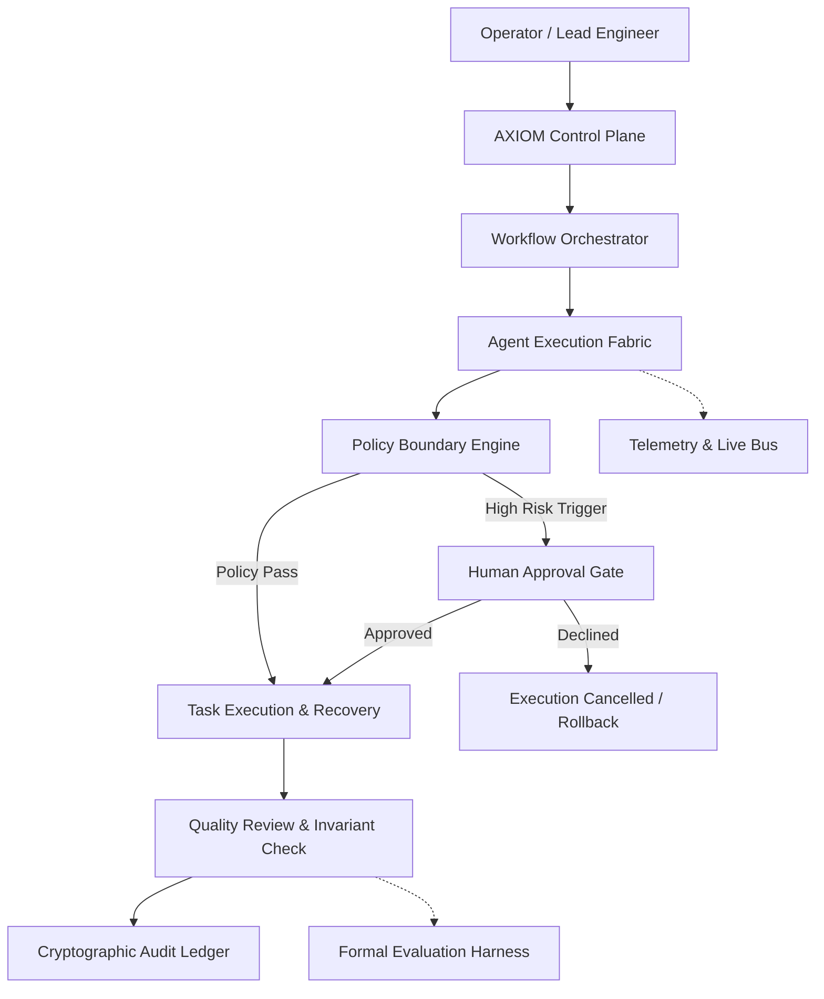
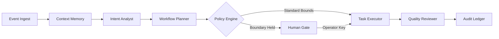
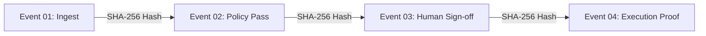

# AXIOM

### Autonomous Operations. Autonomous intelligence, under human control.


AXIOM is an Autonomous Operations Control Plane designed to coordinate AI agents across multi step workflows while keeping execution within explicit policy boundaries, human approval gates, and verifiable audit records.

> Autonomy should increase operational capability without removing human control.

AXIOM unifies agent orchestration, deterministic policy enforcement, human intervention, failure recovery, simulation sandboxes, and tamper evident audit structures into a single operational control room.

---

## 01 | The Problem

AI agents are capable of reasoning, planning, invoking tools, and completing complex tasks. Useful operational autonomy, however, introduces systemic operational risks:

* **Uncontrolled Execution:** Agents executing API actions without formal boundary verification.
* **Unclear Agent Coordination:** Fragile interactions between agents without deterministic dependency tracking.
* **Policy Violations:** High impact actions occurring without automated governance checks.
* **Lack of Human Intervention Points:** Inability for operators to inspect, hold, or reject critical mutations.
* **Difficult Failure Recovery:** Silent errors or cascading failures without compensatory rollback mechanisms.
* **Weak Execution Traceability:** Opaque model reasoning that prevents operational post mortem analysis.
* **Insufficient Auditability:** Lack of cryptographic state records for enterprise and regulatory compliance.

AXIOM addresses these challenges by surrounding autonomous agents with an institutional governance and orchestration control plane.

---

## 02 | The AXIOM Approach

AXIOM treats autonomous agents as coordinated components inside a governed execution fabric. Rather than granting unconstrained execution authority, all agent actions progress through an explicit lifecycle:

```text
Event Ingest
    ↓
Context Memory
    ↓
Intent Analysis
    ↓
Workflow Planning
    ↓
Policy Evaluation
    ↓
Human Authority Gate
    ↓
Task Execution
    ↓
Quality Verification
    ↓
Cryptographic Audit Ledger
```

Autonomy is permitted to operate at high velocity within validated operational boundaries, while high risk actions halt at deterministic human approval gates.

---

## 03 | Core Principles

| # | Principle | Operational Definition |
| :--- | :--- | :--- |
| **01** | **Substantive Utility** | Agents must accomplish concrete, domain specific tasks and generate verifiable operational outcomes. |
| **02** | **Orchestration Integrity** | Multi agent workflows must follow explicit directed graphs with verified dependency resolution. |
| **03** | **Operational Reliability** | Systems must provide transparent failure handling, idempotency tokens, sandboxed testing, and automated rollbacks. |
| **04** | **Human Control** | Operators must retain absolute authority to inspect, approve, decline, pause, or terminate any autonomous run. |

---

## 04 | System Architecture

The following diagram illustrates the structural architecture of the AXIOM Control Plane:



Execution and governance are decoupled. Agents propose and plan actions, but execution is gated by the policy engine and human oversight boundaries.

---

## 05 | Multi Agent Orchestration

AXIOM organizes autonomous agents into deterministic Directed Acyclic Graphs (DAGs). Each stage in a workflow represents a dedicated agent, policy check, verification step, or human approval point.



### Execution Lifecycle States

Each workflow step maintains an explicit lifecycle state:

* `QUEUED`: Task initialized and awaiting prerequisite dependencies.
* `RUNNING`: Agent actively computing parameter envelopes.
* `VALIDATING`: Invariant engine verifying pre conditions.
* `WAITING_APPROVAL`: Execution paused pending operator sign off.
* `APPROVED`: Cryptographic approval token registered.
* `EXECUTING`: Atomic API or ERP tool invocation in progress.
* `COMPLETED`: Invariants verified and state proof recorded.
* `FAILED`: Execution stopped due to exception or invariant breach.
* `ROLLING_BACK`: Compensatory reverse transaction executing.
* `ROLLED_BACK`: State safely restored to baseline checkpoint.

---

## 06 | Human Control

Human oversight is the foundational pillar of AXIOM. Autonomy is stratified by risk tier:

```text
LOW RISK ACTION
  → Policy Evaluation: PASS
  → Instant Autonomous Execution
  → Cryptographic Audit Log Committed

HIGH RISK ACTION (Outlays > $10,000 / Production Deployments / Credential Rotation)
  → Policy Evaluation: BOUNDARY TRIGGERED
  → Mandatory Human Authority Gate
  → Operator Inspection: Approve or Decline
  → Execute with Operator Signature OR Execute Rollback Compensation
```

### Operator Authority Capabilities

* **Explicit Approval and Rejection:** High risk decisions require active operator sign off with structured justifications.
* **Global Emergency Stop:** Immediate pause of all autonomous agent dispatch loops across the fleet.
* **Deterministic Inspection:** Operators inspect observed inputs, threshold boundaries, and risk scores before granting approval.
* **Non Repudiation:** All operator interventions are signed and committed to the audit trail.

---

## 07 | Policy Boundary Engine

The Policy Engine serves as the execution boundary for all agent directives. It evaluates runtime parameters against institutional rules before any state mutation occurs.

```text
Inbound Agent Payload
         ↓
  Policy Engine
         ↓
 ┌───────┬───────┬───────┐
 ↓       ↓       ↓       ↓
ALLOW   WARN   BLOCK   HUMAN GATE
 │       │       │       │
 │       │       │       └─► Route to Human Authority Queue
 │       │       └─────────► Terminate & Record Violation
 │       └─────────────────► Proceed with Flagged Telemetry
 └─────────────────────────► Autonomous Dispatch Permitted
```

Decision evidence is structured and inspectable: operators see the exact policy code (e.g. `FIN-042`), configured threshold, observed parameter, and calculated risk score without requiring raw model chain of thought dumps.

---

## 08 | Cryptographic Audit Ledger

AXIOM records state transitions inside a tamper evident audit structure. Each entry preserves the provenance of both autonomous and human actions.



### Audit Record Metadata

* **Execution ID:** Unique operational trace identifier (e.g. `AX-93821`).
* **Agent ID & Version:** Explicit identity of the executing agent.
* **Policy ID:** Active governance rule applied during evaluation.
* **Human Operator Identity:** Signer metadata when human gates are triggered.
* **State Hash:** SHA-256 checksum of input and output parameter envelopes.
* **Idempotency Token:** Unique key preventing duplicate external mutations.
* **Timestamp:** High resolution execution timestamp.

---

## 09 | Reliability and Recovery

Autonomous systems must account for operational failure. AXIOM treats failure handling, retries, and rollbacks as native execution states.

```text
[RUNNING] ──► [FAILED] ──► [RETRY WITH BACKOFF] ──► [RECOVER] ──► [VERIFY] ──► [COMPLETED]
                 │
                 └──► [COMPENSATORY ROLLBACK] ──► [SAFE CHECKPOINT RESTORED]
```

### Resilience Mechanisms

* **Idempotency Verification:** Mandatory tokens on external write requests prevent duplicate side effects.
* **Atomic Rollbacks:** Reverse compensation transactions restore baseline state upon partial execution failure.
* **Sandboxed Validation:** Ephemeral staging environments test code and configuration changes prior to production deployment.
* **Hot Standby Failover:** Instant rerouting to standby agent replicas if primary node latency breaches service thresholds.

---

## 10 | Evaluation Harness

AXIOM includes a formal evaluation harness designed to assess autonomous agent performance across four objective dimensions:

| Evaluation Dimension | What AXIOM Measures |
| :--- | :--- |
| **Substantive Utility** | Task completion rate, output accuracy, citation grounding, and domain correctness. |
| **Orchestration Integrity** | DAG traversal correctness, dependency resolution, and zero circular deadlock states. |
| **Operational Reliability** | Invariant adherence, failure recovery rate, and rollback consistency. |
| **Human Control** | Human gate routing precision, escalation accuracy, and operator override responsiveness. |

---

## 11 | Operational Control Room

The AXIOM web application provides a comprehensive visual control room for operators:

* **Live Mission Map:** Interactive SVG operational topology with real time edge traffic animation, node inspection, and focus mode.
* **Execution Replay Studio:** Deterministic flight recorder with timeline scrubber, playback controls, and state diff synchronization.
* **Autonomous Decision Stream:** Real time feed of structured decision cards with observed versus threshold comparisons.
* **Dependency Impact Simulator:** Transitive blast radius calculation simulating component failures across the DAG.
* **What-If Decision Simulator:** Counterfactual scenario sandbox to test boundary changes prior to policy deployment.
* **Probability x Impact Risk Heatmap:** Interactive matrix mapping active workflow risk vectors.
* **Agent Collaboration Canvas:** Directed IPC messaging graph showing packet payloads and transmission latencies.
* **System Time Travel:** Snapshot scrubber reconstructing historical system states across time checkpoints.
* **Autonomy Index Scorecard:** Transparent weighted composite metric tracking fleet governance health.

---

## 12 | Key Features

| Feature | Operational Purpose |
| :--- | :--- |
| **Interactive System Topology** | Visualize fleet nodes, dependencies, live latency, and execution traffic. |
| **DAG Workflow Orchestration** | Coordinate multi step workflows with deterministic state transitions. |
| **Policy Boundary Enforcement** | Intercept and evaluate agent actions against configurable governance rules. |
| **Human Approval Queue** | Provide operators with an actionable queue for authorizing high risk steps. |
| **Deterministic Replay Studio** | Reconstruct exact past execution runs with step by step state inspection. |
| **Cascade Failure Simulator** | Analyze downstream dependencies and calculate blast radius for any node. |
| **Counterfactual Simulator** | Test policy parameter adjustments without generating real world side effects. |
| **Tamper Evident Audit Ledger** | Inspect cryptographic state proofs and transaction hashes. |
| **Live Incident Overlay** | Highlight degraded nodes and engage hot standby replicas with one click. |
| **Digital Twin Inspector** | Inspect internal agent memory, active mission payloads, and bound invariants. |

---

## 13 | Technology Stack

| Technology | Role in Project |
| :--- | :--- |
| **React 19** | Modern component architecture and reactive user interface |
| **TypeScript** | Strict static type checking and domain data modeling |
| **Vite 8** | High performance module bundling and development server |
| **Tailwind CSS 4** | Utility first styling framework and layout system |
| **Lucide React** | Consistent, lightweight operational interface iconography |
| **Recharts / D3** | Data visualization, heatmaps, and telemetry sparklines |
| **Zustand** | Central reactive event bus and system state coordination |

---

## 14 | Project Structure

```text
/
├── index.html                   # HTML entry point with metadata and typography tokens
├── package.json                 # Project dependencies, build scripts, and metadata
├── tsconfig.json                # TypeScript compiler configuration
├── vite.config.ts               # Vite build and plugin configuration
├── AGENTS.md                    # Agent fleet documentation and invariant specifications
├── AGENTS_AND_SKILLS.md         # Domain skills and capability assignment matrix
└── src/
    ├── App.tsx                  # Root application shell and modal controller
    ├── main.tsx                 # React application mounting point
    ├── index.css                # Global stylesheet with design system variables
    ├── components/
    │   ├── AxiomMark.tsx        # Institutional brand mark icon
    │   ├── AxiomTable.tsx       # Reusable operational data table
    │   ├── Header.tsx           # Application navigation header and control strip
    │   ├── Sidebar.tsx          # Multi section navigation sidebar
    │   ├── StatusBadge.tsx      # Unified status badge indicator
    │   ├── ToastContainer.tsx   # Operational notification toaster
    │   ├── charts/              # Telemetry charts, sparklines, and metric cards
    │   ├── flow/                # Execution flowcharts and DAG visualizers
    │   ├── inspectors/          # Context drawers for agents, pipelines, and audit
    │   └── mission/             # Mission Control, Replay, Topology, and Simulators
    ├── data/
    │   ├── advancedOpsData.ts   # Baseline operational records, cases, and incidents
    │   ├── agentsAndSkills.ts   # Agent fleet profiles and invariant specifications
    │   ├── metrics.ts           # System performance and throughput metrics
    │   └── policies.ts          # Institutional governance policies and rules
    ├── orchestrator/
    │   ├── axiomEventBus.ts     # Central deterministic event bus and snapshot store
    │   ├── engine.ts            # DAG execution and step traversal engine
    │   ├── runtime.ts           # Runtime simulation loop and clock scheduler
    │   └── store.tsx            # Operations context provider and store
    ├── pages/
    │   ├── AgenticIndexPage.tsx # Editorial index presentation
    │   ├── AgentsPage.tsx       # Agent workforce registry and weekly trends
    │   ├── AnalyticsPage.tsx    # Fleet analytics and latency distributions
    │   ├── ApprovalsPage.tsx    # Human authority gate approval queue
    │   ├── AuditPage.tsx        # Cryptographic audit ledger and proof verification
    │   ├── CasesPage.tsx        # Operational case management desk
    │   ├── DashboardPage.tsx    # Command center dashboard and live mission map
    │   ├── GovernancePage.tsx   # Policy engine rules and time travel scrubber
    │   ├── HealthPage.tsx       # System health metrics and uptime monitoring
    │   ├── IncidentsPage.tsx    # Incident management and anomaly response
    │   ├── JudgeModePage.tsx    # Formal evaluation harness for competition review
    │   ├── SkillsPage.tsx       # Domain skill catalog and assignment matrix
    │   ├── WorkflowsPage.tsx    # Workflow definition registry and execution launcher
    │   └── SettingsPage.tsx     # Operator configuration and control preferences
    ├── styles/
    │   └── tokens.css           # Institutional color palette and typography tokens
    ├── types/
    │   └── index.ts             # Core TypeScript interfaces, types, and schemas
    └── utils/
        └── formatters.ts        # Telemetry, currency, and date formatting utilities
```

---

## 15 | Getting Started

### Prerequisites

* **Node.js:** v18.0.0 or higher
* **npm:** v9.0.0 or higher

### Installation

1. Clone the repository:
   ```bash
   git clone <repository-url>
   ```

2. Navigate to the project root:
   ```bash
   cd axiom
   ```

3. Install all dependencies:
   ```bash
   npm install
   ```

4. Launch the local development server:
   ```bash
   npm run dev
   ```

5. Open `http://localhost:3000` in your web browser to access the AXIOM Control Room.

---

## 16 | Production Build

To compile the application for production deployment:

```bash
# Type check and build optimized bundle
npm run build

# Preview the production build locally
npm run preview
```

To run TypeScript verification without emitting output:

```bash
npm run lint
```

---

## 17 | Design System

AXIOM utilizes an editorial, institutional design language tailored for complex operational control rooms:

* **Canvas:** Warm off white paper canvas (`#FFFDF8` and `#FAF9F5`) to prevent screen fatigue.
* **Typography:**
  * **Headings:** Source Serif 4 for authoritative editorial titles.
  * **Interface Text:** Inter for high legibility UI controls, table rows, and labels.
  * **Technical Telemetry:** IBM Plex Mono exclusively for timestamps, IDs, hashes, and metrics.
* **Color Palette:**
  * **Primary Ink:** Deep Slate Navy (`#182536`)
  * **Controlled Teal:** Operational Success (`#08795F`)
  * **Amber:** Human Gate & Policy Warning (`#B97800`)
  * **Crimson:** High Risk & Critical Incident (`#D72F40`)
* **Geometry:** Architectural spacing, crisp 1px borders, subtle drop shadows, and zero flashy animations.

---

## 18 | Responsive Design

The AXIOM Control Plane is built to support diverse operational environments:

* **Large Displays & Multi Monitor Cockpits:** High density multi panel views with wide canvas utilization.
* **Laptops & Desktops:** Standard operational workspace with collapsible drawers and sidebar navigation.
* **Tablets & Mobile Viewports:** Touch friendly drawer navigation, responsive table scrolling, and stacked metric cards.

---

## 19 | Security and Governance

AXIOM incorporates safety principles into its operational architecture:

* **Principle of Least Privilege:** Agents are granted only the minimum skills and capabilities required for their assigned domain.
* **Deterministic Sandboxing:** Workflow simulations and counterfactual analyses execute without real world side effects.
* **Tamper Evident Auditability:** All state mutations produce verifiable SHA-256 cryptographic proof hashes.
* **Fail Closed Defaults:** Any unhandled exception or policy ambiguity halts execution at a human authority gate.

---

## 20 | Competition Summary

AXIOM is distinguished by its focus on governed, bounded execution:

1. **Governed Autonomy:** Rather than unconstrained agent generation, AXIOM enforces strict mathematical boundaries.
2. **Deterministic Orchestration:** Multi agent collaboration is structured through verifiable DAG pipelines.
3. **Human Authority by Design:** Consequential decisions mandate explicit human authorization.
4. **Inspectable State Provenance:** Every transition produces verifiable evidence hashes.
5. **Operational Resilience:** Native support for compensatory rollbacks, retries, and standby failovers.
6. **Measurable Governance:** Built in evaluation harness assessing utility, orchestration, reliability, and human control.

---

## 21 | Roadmap

Planned future enhancements for the AXIOM Control Plane include:

* **Persistent Event Store:** Distributed event storage backed by PostgreSQL / Cloud SQL for multi year retention.
* **Role Based Access Control (RBAC):** Granular SSO authentication with multi signature authorization policies.
* **Distributed Agent Workers:** Remote execution agent daemons communicating via secure gRPC.
* **Expanded Policy DSL:** Domain specific policy authoring language with natural language linting.
* **Live WebSocket Telemetry Stream:** Real time streaming integration for external enterprise event buses.
* **Expanded Benchmark Suite:** Automated continuous evaluation benchmarks across domain specific tasks.

---

## 22 | Contribution

Contributions to the AXIOM architecture are welcome:

1. Fork the repository.
2. Create a feature branch: `git checkout -b feature/operational-enhancement`
3. Commit your changes: `git commit -m "feat: implement enhanced policy boundary check"`
4. Verify build and types: `npm run lint && npm run build`
5. Push to the branch: `git push origin feature/operational-enhancement`
6. Open a Pull Request with a clear problem statement and validation summary.

---

## 23 | License

This project is available for evaluation, review, and academic research. Review repository terms for specific licensing details.

---

**AXIOM**  
*Autonomous Operations. Autonomous intelligence, under human control.*
